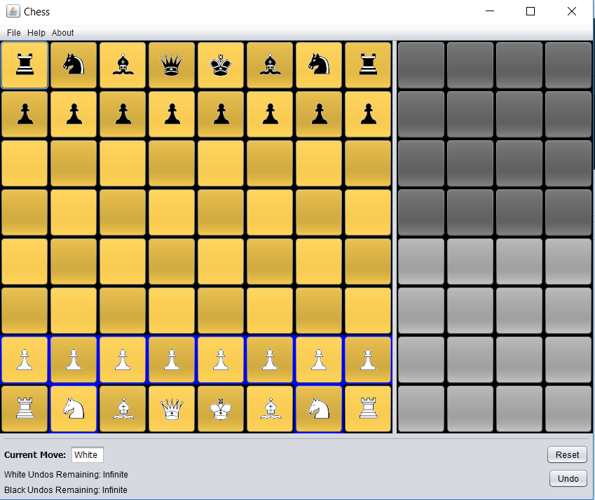
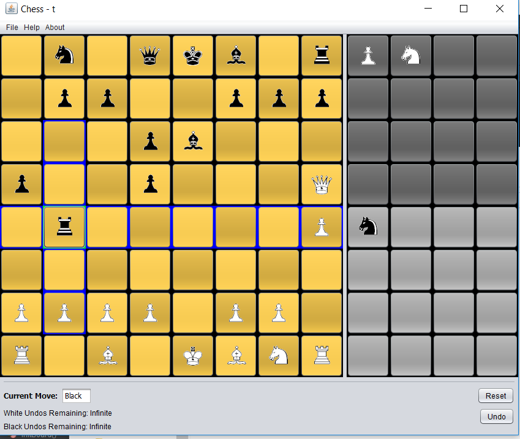
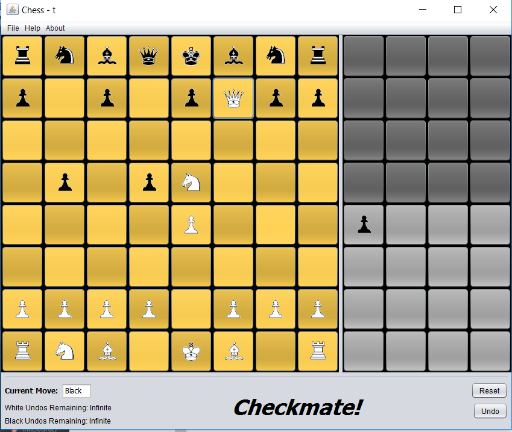

# Chess

## About the program

This program allows the user to play chess.

The pieces that can move have a blue outline. This depends on who's turn it is. Click these buttons to show their possible movesets the movesets will now be outlined in blue, if nothing is outlined in blue, the piece has no available moves. If the piece has available moves, you may choose where you would like the piece to move. If you dont want to move that piece, click on the piece again, it will deselect it

In order to save your game, choose the file item on the menu bar and choose "Save As". Then choose the save file you want to use or create a new one. You can now save to that file with the "Save" menu item

In order to load a previously saved game, choose the file from the "Load" menu item. You can then save that file with "Save"

You can undo moves with the undo button in the bottom right hand corner or the undo menu item. By default, you have infinite undos, if you want to have a limited number of undos, choose the "Limit Undos" menu item. You can now choose to set the number of undos for black pieces and/or white pieces

You can reset the board with the reset button, it will bring up a window checking to make sure you really want to reset because once you do, it overwrites the save
if you want to start a new game, use the save as and then reset or restart the program.

## Installation
If you want to use the program, download the jar file in the dist folder and use that.  I plan to keep that up to date with any changes I make to the program.

If you want the source code, its all in the src folder, each folder in there is a package.  I wrote this program using the netbeans editor which created the forms for the GUI components.

## Screenshots
#### Start of game

#### Movement Options When Choosing Piece

#### Checkmate!

